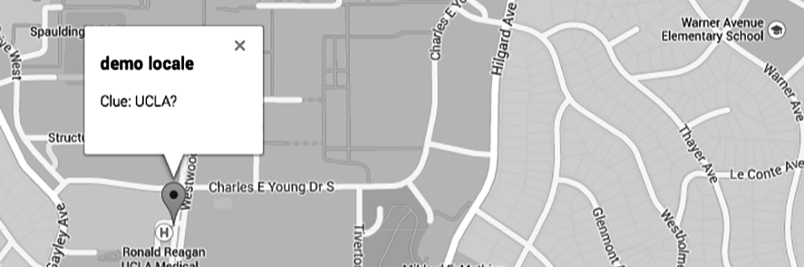
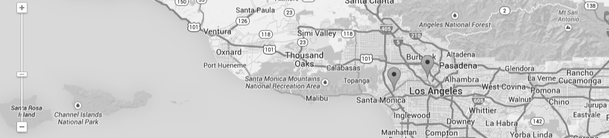
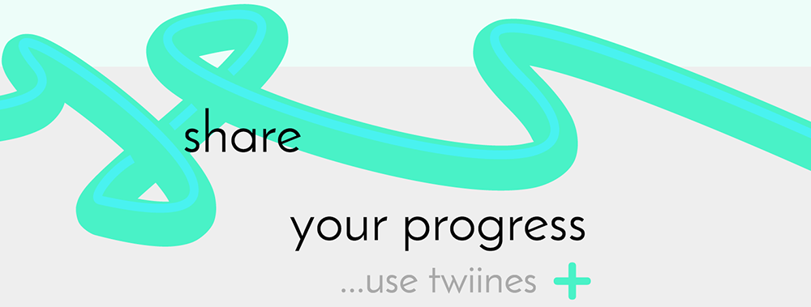
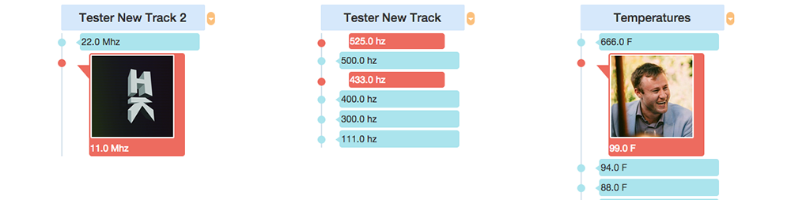
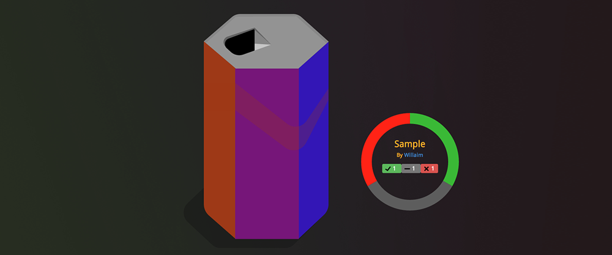
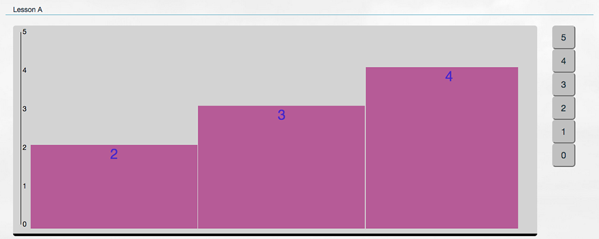

# Table of Contents
- **ECO CAST IPAD** - Manage, record, and share casting sessions 
- **SHOWFAX** - Subscription service for downloading screenplay pages
- **NFC DEAD DROP** - A web enabled geocaching / scavenger hunt using NFC tags
- **TWIINES** - Timeline based micro-blogging. Share updates of projects and track personal goals in a clean and simple fashion
- **BEVERAGE BRAND SPEC** - A social platform where users can upload and vote on designs for a beverage company's labels
- **FIST OF FIVE** - Visualize classroom comprehension

# Eco Cast iPad
#### Manage, record, and share casting sessions
_Currently awaiting internal approval for app store release_

## Challenges:
- Learning iOS development on the fly to meet development deadlines
- Drag and drop between view controllers
- Interaction with webservices
- Preventing and removing strong reference cycles

## Specs:
- Designed for use with iPad Pro models
- Swift 3

# SHOWFAX
#### Subscription service for downloading screenplay sides, empowering working actors across the country
_Although our team completed development, the project was shelved and never deployed_

## Challenges:
* Watermarking PDF files with asynchronous background processing
* Connecting Ruby on Rails to Microsoft SQL Server
* Optimizing site performance with reverse proxying and f5 load balancing

## Specs:
- Ruby on Rails 4
- Puma Server
- NGINX for Static Assets
- Microsoft SQL Server
- Ubuntu

# NFC Dead Drop

[Demo](http://enigmatic-lowlands-7770.herokuapp.com/)
#### NFC Dead Drop is spinoff of the "USB Dead Drop" project mixed with elements of geocaching.  A user must use the map pin and clues provided to track down a 'drop site'.  Once located, the NFC tag can be scanned by smartphone, leading the user to the location check in page. 



## Challenges:
* Create URLs with a unique string to prevent forged check-in events
* Encode unique string to an NFC Tag using a usb writing device
* Displaying location of tags and recent check-ins using Google Maps API
* Create parrallax scrolling front page to make for an intriguing user experience

## Specs:
- Ruby on Rails 4
- NFC Encoding
- PostgreSQL
- Skrollr

```ruby
	random_token = SecureRandom.urlsafe_base64(nil, false)
```

# Twiines

[Demo](http://boiling-tundra-5536.herokuapp.com/)
#### Twiines is a 'limited-scope microblogging platform' that focuses on sharing a chain of events such as a personal goal or project. These chains consist of goals and achievements and can be "twined" together with chains of other users.    


## Challenges:
* Route and understand complex model relationships in Rails and PostgreSQL.
* Configure Amazon Web Services to store user-uploaded photos.
* Sort and filter through multiple model objects for display.
* Structure timeline visual using CSS pseudo elements.

## Specs:
- PostgreSQL *formerly* MongoDB
- Ruby on Rails 4

```ruby
# sorts milestones and stones in the timeline view based on value. Instead of separating them out, and having
# two loops showing milestones and stones this allows the view to render them all together and sort them accordingly.

	def combined_stone_mstone
		milestone_objects = self.milestones.all
		stone_objects = self.stones.all

		@combined_timeline_objects = milestone_objects + stone_objects

		@combined_timeline_objects = @combined_timeline_objects.sort {|m,s| s.sort_value <=> m.sort_value}
	end

```

# GUZL Voting Spec aka 'bevmaster'

[Demo](http://bevmaster.herokuapp.com)
#### Created as a spec for a potential beverage brand client to show a basic voting platform.  It allows users to create and vote on beverage designs. 

## Challenges:
* Create a voting system
* Display vote breakdown using data visualization techniques
* Display can illustration with user-chosen colors
* Highlight colors chosen with responsive display

## Specs:
- Ruby on Rails 4
- PostgreSQL
- Snap.svg
- D3.js

```javascript
var dataset = {
// positive votes(green), meh votes (grey), negative votes (red). defined in the beverages controller.
  states: [gon.positive, gon.meh, gon.negative]
};

var width = 400,
    height = 400,
    radius = Math.min(width, height) / 2;

// color range for pie chart. this pops each variable to a specific color.
var color = d3.scale.ordinal()
    .range(["#3ab936", "#5d5d5d",  "#ff2316"]);

// i love pie
var pie = d3.layout.pie()
    .sort(null);

// sets the inner donut hole and outer radius
var arc = d3.svg.arc()
    .innerRadius(radius - 75)
    .outerRadius(radius - 40);

// i don't really love pie, but pie charts are cool. create pie chart here.
var svg = d3.select("#piechart").append("svg")
    .attr("width", width)
    .attr("height", height)
    .append("g")
    .attr("transform", "translate(" + width / 2 + "," + height / 2 + ")");

// append the pie to put the data in it. sort of like appending the crust to put the filling in it. just a lot less tasty.
// also the attrTween pops in the data in a slick animation.
var path = svg.selectAll("path")
    .data(pie(dataset.states))
  .enter().append("path")
    .attr("fill", function(d, i) { return color(i); })
    .transition().delay(function(d, i) { return i * 800; }).duration(800)
  .attrTween('d', function(d) {
       var i = d3.interpolate(d.startAngle, d.endAngle);
       return function(t) {
           d.endAngle = i(t);
         return arc(d);
       }
  });
```

# Fist of Five

#### Fist of five gathers feedback from a classroom and generates a visual representation for the instructor. While following along with a lesson, each student rates their comprehension of a subject on a scale of zero to five.  This data is available in real time, allowing on-the-fly pivots in teaching styles to improve lesson efficiency. Working as part of a group, I was tasked with using the D3 javascript framework and apply it to the data being generated. 

## Challenges:
* Graph numerical data with javascript data visualization framework: D3.js
* Adjust visualization to accomodate for real-time shifting sample size (amount of users) and user rating values
* Graph data for values from individual users

## Specs:
- Ruby on Rails 4
- PostgreSQL
- D3.js

```javascript
var x = d3.scale.linear().domain([0, data.length]).range([20, width+20]);
var y = d3.scale.linear().domain([0, 5]).range([12, height]);
var yScale = d3.scale.linear().domain([0,5]).range([height - 8, 8]);

// add the svg canvas to the DOM
var vis = d3.select("#Aratings")

// select rectangle elements in svg.
var bars = vis.selectAll("rect")
  .data(data)

// show the bars.
bars.enter().
  append("rect").
  attr("fill", randomed()).
  attr("x", function(datum, index) { return x(index); }).
  attr("width", barWidth);

  bars.transition().
  duration(2000).
  attr("height", height +  margin.bottom).
    attr("y", function(datum) { return height - y(datum.value); }).
    attr("height", function(datum) { return y(height); });

d3.select("#Aratings")
.call(yAxis);
```

