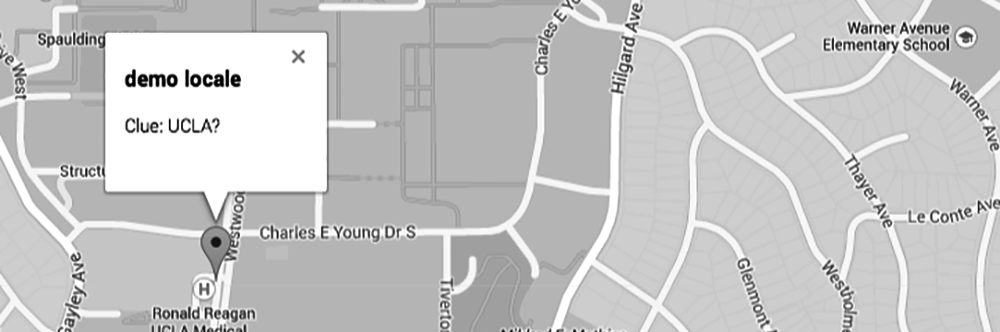

# NFC DEAD DROP

[Demo](http://enigmatic-lowlands-7770.herokuapp.com/)
#### NFC Dead Drop is spinoff of the "USB Dead Drop" project mixed with elements of geocaching.  A user must use the map pin and clues provided to track down a 'drop site'.  Once located, the NFC tag can be scanned by smartphone, leading the user to the location check in page. 



## Challenges:
	
* Create URLs with a unique string to prevent forged check-in events
* Encode unique string to an NFC Tag using a usb writing device
* Displaying location of tags and recent check-ins using Google Maps API
* Create parrallax scrolling front page to make for an intriguing user experience

# Specs:
- Rails 4
- NFC Encoding
- PostgreSQL
- Skrollr

```ruby
	random_token = SecureRandom.urlsafe_base64(nil, false)
```
